# diesel-mas

Мультиагентная система поддержки решений оператора установки гидроочистки
дизельного топлива 24-2000.

## Назначение и область применения

Система прогнозирует содержание серы в гидроочищенном дизельном топливе и
предлагает коррекцию режима до того, как будет нарушен предел 10 мг/кг.
Рассматриваемая цепочка включает АВТ, гидроочистку 24-2000 и блендинг.

Предел 10 мг/кг проверяется для продукта гидроочистки. Данных о компонентах
смешения и о товарном резервуаре в предоставленном пакете нет, поэтому
соответствие товарной смеси спецификации система не подтверждает.
Интерфейс ограничения на сумму долей блендинга реализован и покрыт тестом, а
количественная оптимизация смешения отключена.

Система остаётся советующей. Запись в АСУ ТП не выполняется, интерфейса для
этого нет. Воздействие вносит технолог.

## Основные результаты

Значения получены на блоке с 2025-10-01 по 2026-08-06, 367 лабораторных
анализов. Блок участвовал в выборе конфигурации, см. раздел
[Методика и результаты оценки](#методика-и-результаты-оценки).

| Показатель | Значение | Условия |
|---|---|---|
| MAE прогноза серы, мг/кг | 1,10 | блок 2025-10-01 по 2026-08-06, n = 367 |
| MAE предыдущего лабораторного анализа, мг/кг | 1,71 | тот же блок |
| MAE поточного анализатора, мг/кг | 1,48 | тот же блок |
| MAE медианы обучающего блока, мг/кг | 1,51 | тот же блок |
| RMSE, мг/кг | 1,59 | тот же блок |
| R², безразмерный | 0,47 | тот же блок |
| Эмпирическое покрытие интервала, доля | 0,869 | номинальный уровень 0,90 |
| Средняя ширина интервала, мг/кг | 4,01 | тот же блок |
| Полнота обнаружения превышений по верхней границе, доля | 0,984 | 62 превышения из 367 |
| Точность обнаружения превышений, доля | 0,216 | тот же блок |

Прогноз на горизонты 6, 12 и 24 ч построен и измерен отдельно. MAE
составляет 1,497, 1,523 и 1,571 мг/кг против 1,723, 1,781 и 1,777 у
предыдущего лабораторного анализа на тех же строках. Вероятность превышения уступает постоянной
базовой частоте по Brier на всех трёх горизонтах, поэтому горизонты выводятся
оператору как сведения о тренде и в проверке действия не участвуют.

Софт-сенсоры показателей продукта обучены для 10 целей, навык подтверждён у
четырёх.

Поведение на сетке из 60 циклов решения по тому же блоку приведено в разделе
[Методика и результаты оценки](#методика-и-результаты-оценки).

Все числа генерируются из отчётов командой `python -m scripts.render_results`
и сведены в [reports/results_summary.md](reports/results_summary.md).

## Куда смотреть

- [docs/demo_script.md](docs/demo_script.md), карточка оператора и порядок демонстрации на пять минут.
- [reports/results_summary.md](reports/results_summary.md), сводка публикуемых чисел, собранная из отчётов.
- [docs/evaluation.md](docs/evaluation.md), методика оценки, разбиение по времени и статус блока оценки.
- [docs/architecture.md](docs/architecture.md), агенты, шина сообщений, политики и раунды перепланирования.
- [Ограничения применения](#ограничения-применения), область действия проверки серы и границы интерпретации.
- [Установка и запуск](#установка-и-запуск), команды для расчёта за произвольный период.

## Установка и запуск

Требуется Python 3.11 или новее. Колёс numpy 2.3.5 и scipy 1.16.3 под Python
3.10 не существует, установка на этой версии завершается ошибкой.

```bash
git clone https://github.com/Throddy/diesel-mas.git && cd diesel-mas
python -m venv .venv && source .venv/bin/activate
pip install -r requirements.txt
python run_all.py
streamlit run app.py
```

Файлы организаторов входят в репозиторий и лежат в `data/raw/`. Каталог
исходных данных только читается, распаковка идёт в `data/interim/unpacked`.
Другой каталог задаётся флагом `--data-dir`.

Исходящие соединения не выполняются ни на одном шаге. Свойство проверяется
тестом `tests/test_metamorphic.py::test_system_runs_without_any_network_access`,
который подменяет сокеты функцией, возбуждающей исключение, и затем выполняет
полный цикл решения. Развёртывание в сети без интернета описано в
[docs/deployment_closed_network.md](docs/deployment_closed_network.md).

`run_all.py` выполняет подготовку данных, обучение, оценку, тесты,
демонстрационные сценарии, эксперименты и рендер публикуемых чисел.
Расчёт за произвольный период добавляется флагами.

```bash
python run_all.py --start 2026-01-01 --end 2026-02-01
python -m scripts.backtest --start 2026-03-01 --end 2026-04-01 --cycles 24
```

Отчёт периода сохраняется в `reports/periods/<начало>_<конец>/backtest.json` и
сообщает, пересекается ли период с обучающим блоком. Периоды, значения которых
приведены в документации, перечислены в `reporting.periods` конфигурации и
считаются при каждом прогоне.

## Данные и подготовка признаков

Источники включают телеметрию с шагом 10 мин, лабораторные анализы ЛИМС,
показания поточного анализатора ПАК и формулы софт-сенсоров ВАК. Канонический
слой строится один раз и хранится в parquet. Объёмы источников приведены в
[reports/data_audit.json](reports/data_audit.json).

### Временной контракт

Каждая строка данных описывается четырьмя моментами.

| Поле | Смысл |
|---|---|
| `t_sample` | время отбора пробы или измерения |
| `t_result_available` | время получения результата, для ЛИМС это `t_sample` плюс 120 мин |
| `t_decision` | момент формирования признаков и принятия решения |
| `target_time` | `t_decision` плюс горизонт, для оценки текущего режима совпадает с `t_decision` |

Правило доступности одно для всех режимов работы. Признак, анализ или остаток
калибровки допускается только при `t_result_available` не позже `t_decision`.
Обучение, калибровка, rolling-origin оценка, расчёт за период, воспроизведение
истории и работа цикла используют один и тот же код отбора по времени.

`Dataset.meta` хранит `decision_time`, `sample_time` и `result_available_time`
для каждой строки. Отсутствие утечки из будущего проверяется функцией
`assert_no_future` и тестами в `tests/test_time_availability.py`, включая
проверку того, что для каждого признака и каждого остатка калибровки
`t_result_available` не позже `t_decision`.

Остатки конформной калибровки помечаются временем получения результата.
Отбираются только остатки, полученные до момента решения, независимо от
размера окна. Если доступных остатков меньше десяти, квантиль не определён,
интервал и вероятность превышения не строятся. Состояние передаётся в решение,
объяснение и интерфейс со статусом `INSUFFICIENT_HISTORY`. Искусственный
интервал не подставляется.

Из обучения, модельных диапазонов и оценки тяжести режима исключены 92
интервала. Каждая строка [reports/excluded_periods.csv](reports/excluded_periods.csv)
содержит начало, конец, причину и детектор. Причины включают переходный режим,
останов, флэтлайн анализатора, отказ датчика давления и неправдоподобный
лабораторный результат. В аудите данных эти периоды остаются видимыми.

Признаки модели прогноза делятся на четыре группы.

| Группа | Содержание | Количество |
|---|---|---|
| Скользящие статистики тегов | значение, средние за 60 и 360 мин, стандартное отклонение за 180 мин, приращение за 180 мин | 35 |
| Источники качества | предыдущий лабораторный анализ, показание анализатора с оценкой исправности, сера сырья с учётом возраста | 15 |
| Динамика управляемых параметров | размах, число разворотов знака приращения, суммарный ход и наклон по ht:T5, ht:F9 и ht:P3 на окнах 6, 12, 24 и 72 ч | 48 |
| Индекс активности катализатора | медиана требуемого сдвига температуры за 90 сут | 1 |

Группа динамики управляемых параметров вычисляется из измеренных значений
тегов. Задания регуляторам в пакете отсутствуют, поэтому признаки описывают
наблюдаемую динамику процесса и не являются записью действий регулятора.
Проверка на дублирование скользящих статистик даёт медиану максимальной
корреляции 0,397, значений выше 0,9 нет, выше 0,8 два.

Индекс активности катализатора получается обращением модели отклика. Для
каждого лабораторного анализа определяется температура, при которой модель
воспроизвела бы найденное содержание серы при фактических нагрузке и сере
сырья. Разность с фактической температурой служит индексом. Модель отклика для
этого признака обучается только на обучающем блоке, а значение читается с
лабораторным запаздыванием, поэтому анализ, которым размечена строка, в её
признаки не входит. Проверки лежат в `tests/test_feature_blocks.py`.

Полный словарь данных приведён в
[docs/data_dictionary.md](docs/data_dictionary.md), сверка семантики каждого
используемого тега с обновлённым справочником КИП в
[docs/tag_mapping_check.md](docs/tag_mapping_check.md) и
[reports/tag_semantics.md](reports/tag_semantics.md).

## Архитектура и порядок принятия решения

Система состоит из семи агентов, обменивающихся типизированными неизменяемыми
сообщениями через шину с журналом. Идентификатор сообщения вычисляется по его
содержимому. Каждая группа чисел в карточке оператора ссылается на
идентификатор сообщения, из которого она получена.

| Агент | Ответственность |
|---|---|
| DataQualityAgent | состояние источников, возраст измерений, расхождение ЛИМС и ПАК |
| QualityAgent | прогноз серы с интервалом, прогноз на горизонты, оценки показателей, риск превышения |
| ReliabilityAgent | прокси тяжести режима и выход за область обучения |
| OptimizationAgent | генерация и ранжирование вариантов воздействия |
| WhatIfAgent | ожидаемый эффект варианта по модели отклика |
| SafetyAgent | вердикт по жёстким ограничениям с указанием горизонта проверки |
| ExplainerAgent | текст карточки оператора |

Цикл решения проходит семь шагов. Проверка данных, прогноз с интервалом,
оценка тяжести режима, генерация вариантов, расчёт ожидаемого эффекта, отсев
по жёстким ограничениям, карточка оператора либо обоснованный отказ.

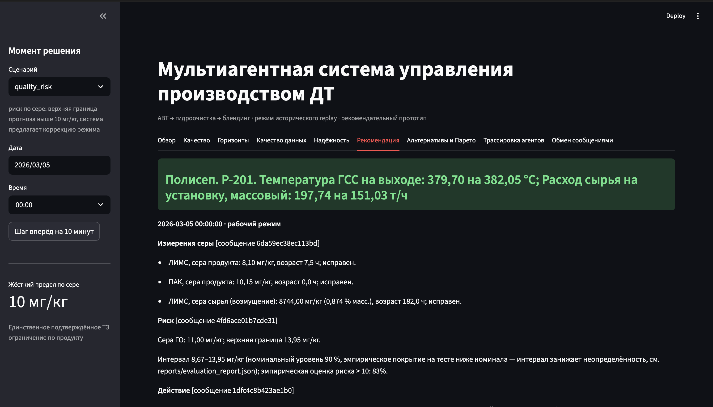

Вкладка рекомендации: заголовок с предлагаемым изменением режима, измерения серы и прогноз риска.

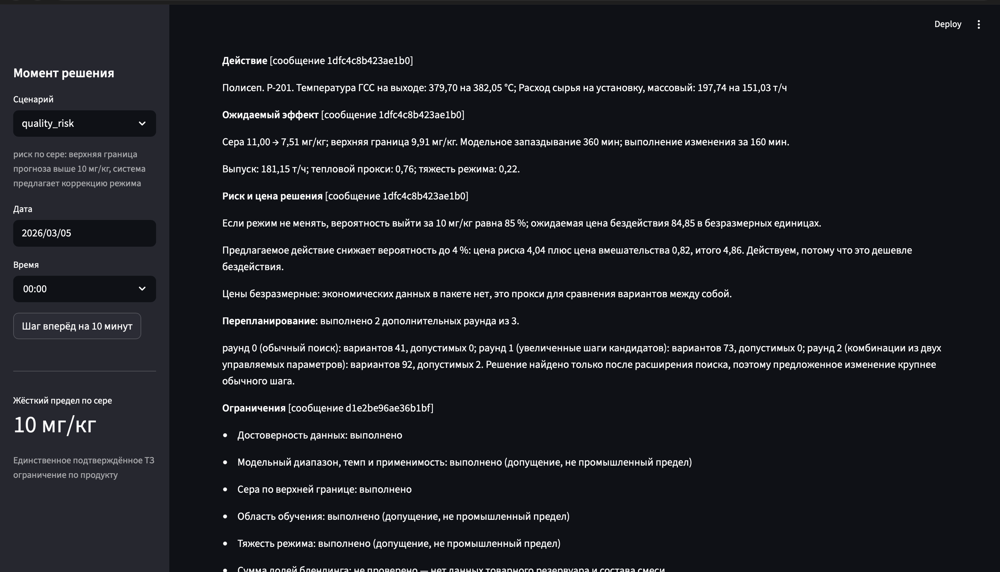

Предлагаемое действие, ожидаемый эффект, цена решения, раунды перепланирования и начало списка ограничений.

<details>
<summary>Подробности рекомендации и проверки</summary>

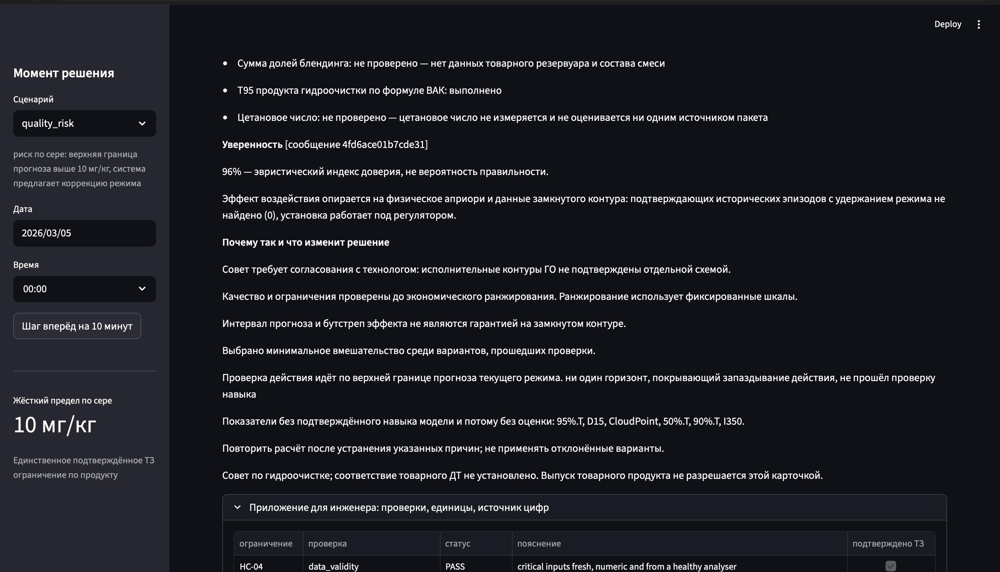

Уверенность, обоснование выбора и ограничения применимости рекомендации.

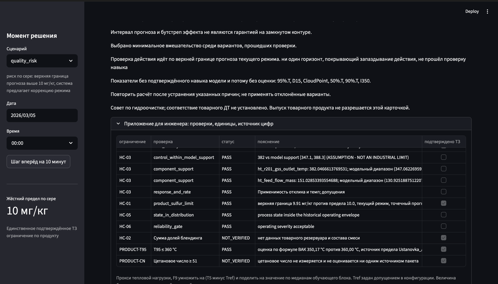

Таблица проверок с результатами PASS и NOT_VERIFIED.

</details>

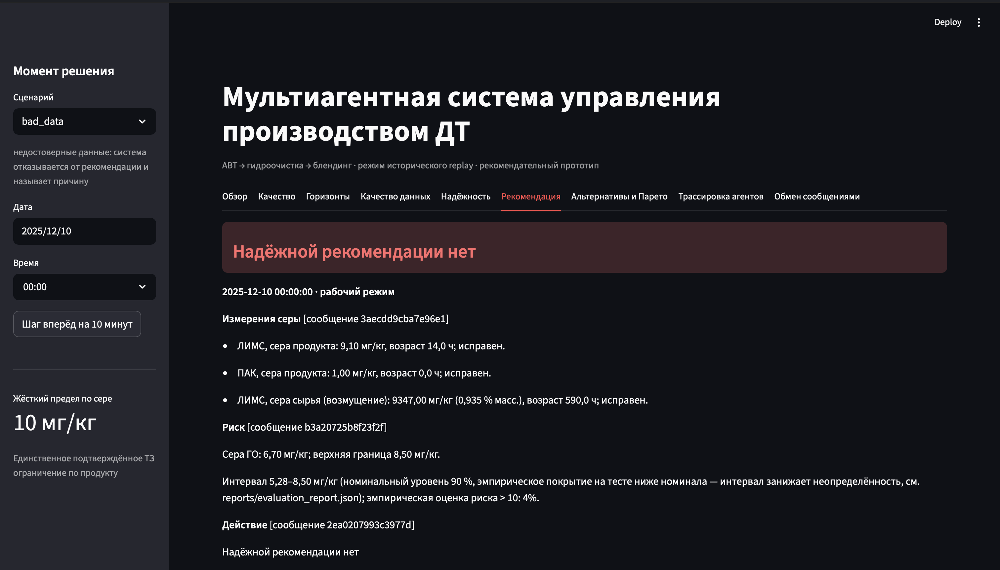

Вкладка рекомендации в сценарии недостоверных данных: заголовок отказа, измерения серы и прогноз.

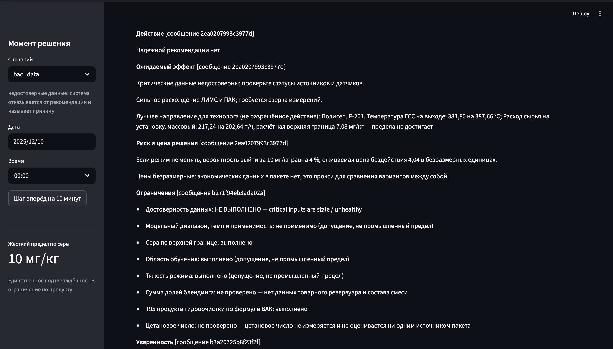

Причина отказа, расхождение ЛИМС и ПАК, список ограничений с результатами проверок.

<details>
<summary>Подробности отказа и проверки</summary>

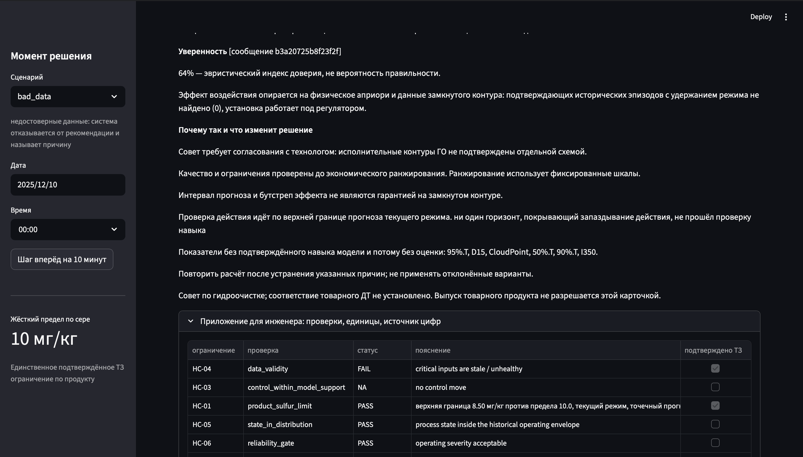

Уверенность, пояснения и таблица проверок с отказом проверки достоверности данных.

</details>

Вариант "удержать режим" присутствует всегда и стоит первым. Блокировать
решение может любой агент, снять блокировку не может никто. Конфликты
разрешаются лексикографической политикой по измерениям в порядке данные,
безопасность, качество, надёжность, выпуск, энергия.

Если после вердикта безопасности допустимых вариантов не осталось, оркестратор
отправляет запрос на перепланирование. Раундов четыре, считая обычный поиск
нулевым.

| Раунд | Дополнительно разрешено | Циклов | Среднее время, с | Худшее время, с |
|---|---|---|---|---|
| 0 | обычный поиск | 41 | 0,155 | 0,171 |
| 1 | увеличенные шаги кандидатов | 8 | 0,352 | 0,391 |
| 2 | комбинации двух управляемых параметров | 2 | 0,585 | 0,607 |
| 3 | снижение нагрузки | 9 | 0,841 | 0,946 |

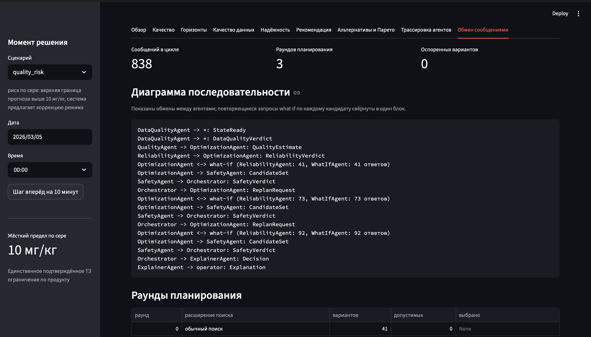

Вкладка обмена сообщениями: счётчики цикла и последовательность обменов между агентами, включая запросы перепланирования.

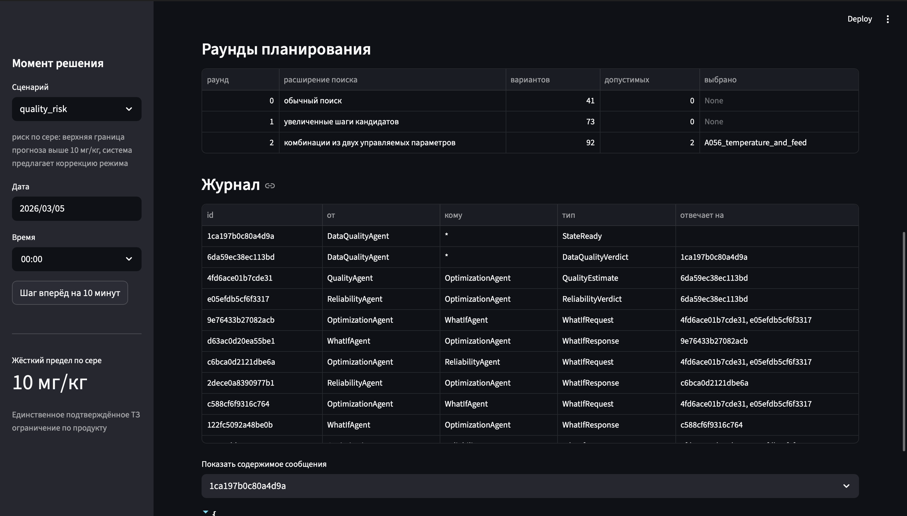

Таблица раундов планирования и журнал запросов и ответов между агентами.

<details>
<summary>Пример содержимого сообщения</summary>

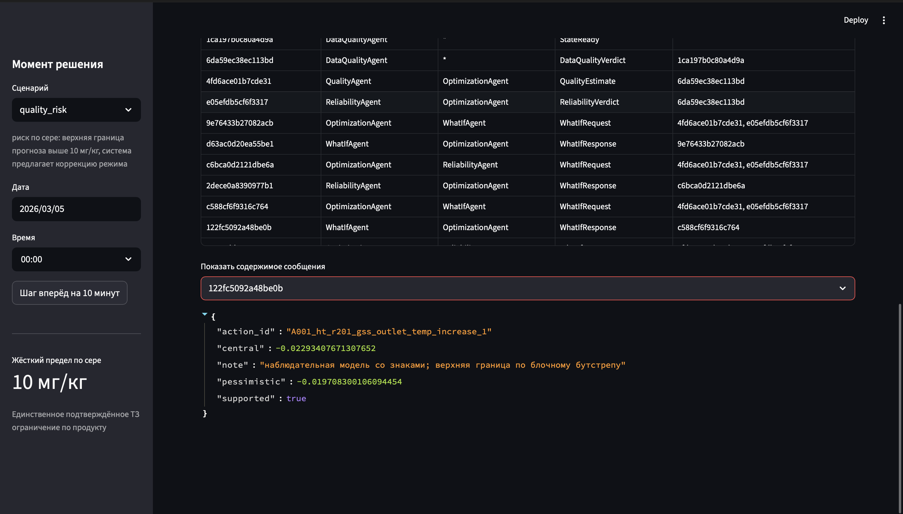

Ответ WhatIfAgent по кандидату с повышением температуры: поля central и pessimistic с оценками эффекта и признак применимости supported; показана оценка отдельного кандидата, окончательный выбор делается после всех проверок.

</details>

Сравнение конфигураций с одним раундом и с четырьмя на той же сетке из 60
циклов даёт долю отказов 0,433 против 0,267. Десять циклов получают
исполнимую рекомендацию, ни один цикл рекомендацию не теряет, выбор
варианта не изменяется ни в одном цикле, где рекомендация выдавалась в обеих
конфигурациях. Измерение выполняет `python -m scripts.replan_value`,
результат в [reports/replan_value.json](reports/replan_value.json).

Повторное воздействие на один управляемый параметр блокируется, пока не прошла
постоянная времени реактора 180 мин или пока эффект не начал проявляться.
Блокировка снимается, если продукт находится вне спецификации по точечному
прогнозу. Правило действует под любым правилом ранжирования.

Подробное описание шины, сообщений и политик приведено в
[docs/architecture.md](docs/architecture.md).

## Прогноз качества и модель отклика

Решение опирается на модель прогноза, модель отклика и набор моделей на
горизонты.

Модель прогноза N оценивает содержание серы при текущем режиме. Это случайный
лес по 99 признакам с интервалом, построенным методом разделённого
конформного предсказания. Квантиль берётся по остаткам последних 90
лабораторных анализов, результат которых получен до момента решения. Остаток
помечается временем получения результата, то есть временем отбора пробы плюс
120 мин. Если доступных остатков меньше десяти, интервал и вероятность
превышения не строятся. Прогноз в этом случае получает статус
`INSUFFICIENT_HISTORY`.

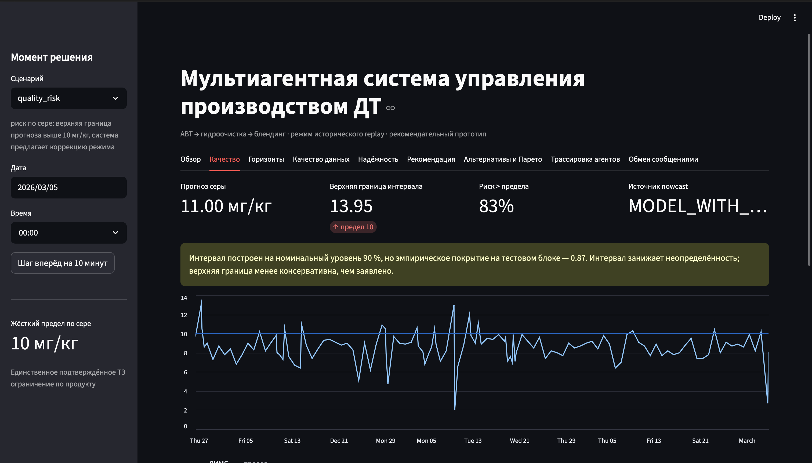

Вкладка качества: показатели прогноза, предупреждение о фактическом покрытии интервала и график лабораторных анализов с пределом.

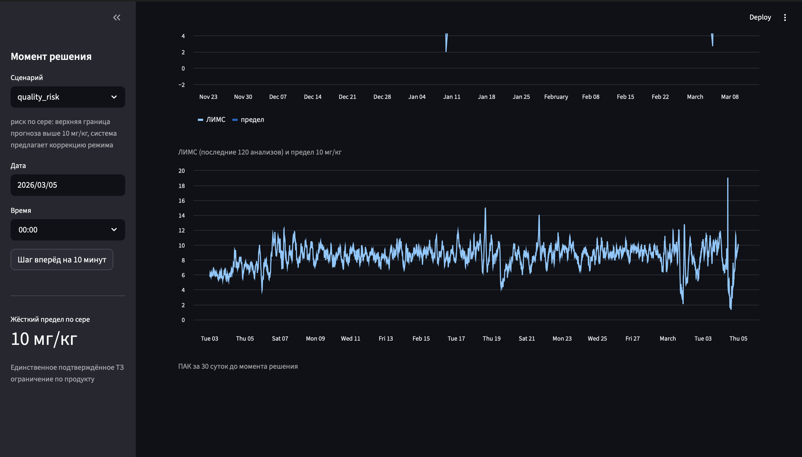

График показаний поточного анализатора за 30 суток до момента решения.

Модель отклика M оценивает изменение содержания серы при изменении
управляемого параметра. Форма логарифмически-линейная, регрессоры
преобразованы так, что физически ожидаемые знаки соответствуют
неотрицательным коэффициентам, и неотрицательность задана ограничением
оптимизации. Величина температурного члена получена совместной оценкой данных
и литературного априори.

| Источник оценки | d ln S / dT, 1/°C |
|---|---|
| Только данные | +0,0038 |
| Физическое априори | -0,0343 |
| Совместная оценка, используется | -0,0204 |

Блочный бутстреп по неделям даёт интервал 90 % от -0,0247 до -0,0173 при 735
обучающих точках. Установка работает с регуляторами обратной связи, поэтому
наблюдаемая связь температуры и серы смещена к нулю и по данным оказывается
положительной. Знак задан химией гидроочистки, а величина уточнена данными.
Причинный эффект этим не установлен.

Путь влияния температуры проверяется контролируемым тестом
`python -m scripts.temperature_path`. Температура сдвигается в пределах
области поддержки модели отклика, остальные 96 признаков из 99 сохраняют
значения.

| Сдвиг, °C | ht:T5, °C | Прогноз N, мг/кг | Верхняя граница, мг/кг | Отношение по M |
|---|---|---|---|---|
| -6,0 | 373,70 | 11,033 | 13,996 | 1,126 |
| -4,0 | 375,70 | 11,009 | 13,966 | 1,082 |
| -2,0 | 377,70 | 10,998 | 13,952 | 1,040 |
| 0,0 | 379,70 | 10,998 | 13,952 | 1,000 |
| +2,0 | 381,70 | 10,998 | 13,952 | 0,962 |
| +4,0 | 383,70 | 10,973 | 13,921 | 0,925 |
| +6,0 | 385,70 | 10,961 | 13,906 | 0,890 |

Наклон ln прогноза по температуре равен -0,00046 1/°C, то есть модель N почти
не реагирует на температуру. Ожидаемый эффект воздействия рассчитывается
моделью M, где наклон равен -0,0204 1/°C. Оба значения описывают отклик
модели, а не отклик установки. Результат сохраняется в
[reports/temperature_path.json](reports/temperature_path.json).

### Прогноз на горизонты 6, 12 и 24 часа

Горизонт означает момент `t_decision` плюс horizon. Признаки собираются на
`t_decision`, цель берётся на `target_time`, а лабораторные признаки
отсекаются по времени получения результата. Для каждого горизонта обучается
отдельная модель со своими блоками обучения, отбора и калибровки
(`python -m scripts.train_horizons`).

Результат каждого горизонта содержит `horizon_hours`, `prediction`,
`interval_lower`, `interval_upper`, `interval_level`,
`probability_above_limit`, `training_cutoff`, `calibration_cutoff`,
`feature_as_of_time`, `target_time` и `data_status`. При нехватке целевых или
калибровочных данных возвращается `NO_TARGET` или `INSUFFICIENT_HISTORY`, и
интервал не подставляется.

Оценка выполнена rolling-origin с переобучением каждые 30 сут на данных,
доступных к началу окна (`python -m scripts.eval_horizons`).

| Горизонт, ч | Сравнено строк | MAE, мг/кг | MAE базовой оценки, мг/кг | MedianAE, мг/кг | RMSE, мг/кг | R² | Покрытие, доля | Ширина, мг/кг | Brier | Brier базовой частоты |
|---|---|---|---|---|---|---|---|---|---|---|
| 6 | 364 | 1,497 | 1,723 | 1,145 | 2,042 | 0,083 | 0,874 | 6,75 | 0,160 | 0,139 |
| 12 | 362 | 1,523 | 1,781 | 1,151 | 2,119 | -0,017 | 0,887 | 7,00 | 0,163 | 0,140 |
| 24 | 358 | 1,571 | 1,777 | 1,220 | 2,113 | -0,116 | 0,908 | 7,10 | 0,171 | 0,141 |

Базовая оценка, предыдущий лабораторный анализ, доступный на момент решения.
Модель и базовая оценка сравниваются на одних и тех же строках, их число
приведено в колонке. Полнота обнаружения превышений по верхней границе
составляет от 0,951 до 0,967, точность от 0,170 до 0,174.

Горизонт участвует в проверке действия, если его MAE ниже базовой оценки и
Brier ниже Brier базовой частоты. Первое условие выполняется на всех трёх
горизонтах. Второе не выполняется ни на одном. R² на 12 и 24 ч отрицателен.
Проверка действия поэтому остаётся на верхней границе прогноза текущего
режима. Решение публикует источник проверки и причину выбора. Горизонты выводятся
оператору как сведения о тренде.

Транспортное запаздывание равно 360 мин, поэтому действие с задержанным
эффектом покрывает горизонт 6 ч. Как только его Brier опустится ниже Brier
базовой частоты, проверка перейдёт на этот горизонт без изменения кода.

### Софт-сенсоры показателей продукта гидроочистки

Инвентаризация охватывает 10 показателей точки отбора продукта гидроочистки с
известной единицей и известным временем доступности результата. Для каждого
показателя обучается модель по телеметрии на момент решения и предыдущему
доступному анализу этого показателя (`python -m scripts.train_soft_sensors`).

| Показатель | Единица | Наблюдений | Сравнено | MAE | MAE базовой оценки | MedianAE | RMSE | R² | Смещение | Покрытие, доля | Ширина | Предел | Статус |
|---|---|---|---|---|---|---|---|---|---|---|---|---|---|
| 95%.T | °С | 1291 | 295 | 5,223 | 4,908 | 4,547 | 6,566 | -0,193 | -0,500 | 0,953 | 26,21 | 360,0 | NO_SKILL |
| FlashPoint | °С | 1518 | 334 | 3,008 | 3,512 | 2,025 | 4,467 | 0,055 | 1,057 | 0,931 | 14,17 | нет | OK |
| D15 | кг/м3 | 1015 | 159 | 1,934 | 1,632 | 1,259 | 2,874 | 0,387 | -0,262 | 0,786 | 5,06 | нет | NO_SKILL |
| CloudPoint | °С | 1198 | 306 | 0,960 | 0,905 | 0,719 | 1,290 | 0,238 | 0,296 | 0,977 | 5,82 | нет | NO_SKILL |
| 50%.T | °С | 1252 | 256 | 4,238 | 2,754 | 2,556 | 6,695 | -1,181 | -2,021 | 0,992 | 43,70 | нет | NO_SKILL |
| 90%.T | °С | 1252 | 256 | 4,747 | 3,945 | 3,897 | 6,472 | -0,472 | -1,649 | 0,938 | 25,01 | нет | NO_SKILL |
| IBP.T | °С | 1291 | 295 | 4,988 | 5,424 | 3,966 | 6,625 | -0,203 | -2,554 | 0,875 | 19,08 | нет | OK |
| I250 | % об. | 1280 | 289 | 2,530 | 2,623 | 1,862 | 3,452 | 0,357 | 0,500 | 0,893 | 11,10 | нет | OK |
| I350 | % об. | 1277 | 288 | 8,184 | 2,458 | 5,003 | 13,080 | -1,661 | -6,981 | 0,892 | 32,07 | нет | NO_SKILL |
| CFPP | °С | 417 | 99 | 1,175 | 1,424 | 0,845 | 1,631 | 0,328 | 0,245 | 0,909 | 4,79 | нет | OK |

Базовая оценка, предыдущий лабораторный анализ показателя, доступный на момент
решения. Модель и базовая оценка сравниваются на одних и тех же строках, их
число приведено в колонке. Единицы измерения даны в мг/кг для плотности и в
градусах Цельсия или процентах объёма для остальных показателей, как в
лабораторном источнике. Модель используется, если её MAE ниже базовой оценки
и калибровочная выборка достаточна. Критерий проходят FlashPoint, IBP.T, I250, CFPP.
Остальные показатели получают статус `NO_SKILL` и оценку не выдают.

Промышленный предел подтверждён источником только для 95%.T, документ
Ustanovka_AVT_merged.pdf, лист 4. Обученная модель этого показателя навыка не
показала и в ограничении не участвует. Мягкая проверка T95 выполняется
формулой ВАК организаторов. Показатели без подтверждённого предела
в жёстких ограничениях не участвуют.

Система различает четыре вида величин. Измерение, это лабораторный анализ или
показание анализатора. Формула ВАК, это расчёт по выражению организаторов.
Софт-сенсор, это обученная модель показателя. Прокси, это расчётная величина
без измеряемого аналога, например индекс тяжести режима. Вид указывается в
выводе QualityAgent и в интерфейсе.

### Индекс активности катализатора

Индекс активности катализатора публикуется как индикатор. По 1296 анализам
медиана индекса равна -3,6 °C, среднее за последние 30 сут 0,4 °C, оценка
тренда 7,6 °C в месяц. Разброс индекса по соседним анализам составляет около
6,5 °C, а окно в 30 сут содержит менее двух десятков точек, поэтому тренд в
этом виде не интерпретируется и в принятии решений не участвует. Дат
регенерации в пакете нет, календарный возраст катализатора не рассчитывается.

## Методика и результаты оценки

Разбиение по времени выполнено без перемешивания строк. Обучение до
2025-02-28, валидация и калибровка до 2025-09-30, оценка с 2025-10-01.
Критерием отбора модели, лага и гиперпараметров служит MAE в логарифмическом
пространстве, устойчивая к размаху лабораторных значений от 0,1 до
2120 мг/кг.

Блок с 2025-10-01 участвовал в выборе конфигурации. Решение отклонить
сокращение набора признаков и решение о составе блоков признаков принимались
с учётом значений на этом блоке. Приведённые метрики поэтому характеризуют
конфигурацию, настроенную с участием этого блока, и не являются независимой
итоговой оценкой обобщающей способности. Отдельного неиспользованного блока в
предоставленных данных не остаётся, поскольку записи заканчиваются
2026-08-09. Независимая оценка требует новых данных.

Обнаружение превышений считается по верхней границе интервала, поэтому
полнота высока, а точность низка. Верхняя граница пересекает предел в 282
моментах из 367, что составляет 77 %. Медиана содержания серы равна около
8,5 мг/кг при пределе 10, а типичная мультипликативная ошибка прогноза
составляет около 17 %, поэтому запас до предела сопоставим с ошибкой модели.
Сужение интервала без подтверждения покрытия означало бы выдачу рекомендаций,
безопасность которых не проверена.

Поведение системы измеряется на сетке из 60 циклов решения, равномерно
распределённых по блоку оценки.

| Показатель | Значение | Условия |
|---|---|---|
| Нарушений жёсткого предела среди выданных рекомендаций | 0 | 60 циклов, проверка по верхней границе модели N |
| Доля отклонённых небезопасных вариантов | 100 % | 2337 вариантов с верхней границей выше предела |
| Доля отказов | 27 % | 60 циклов |
| Доля действия при прогнозе выше предела | 77 % | 43 цикла с риском |
| Среднее время цикла, с | 0,30 | 60 циклов |
| Худшее время цикла, с | 0,95 | цикл с четырьмя раундами |
| Одинаковый вход даёт одинаковую рекомендацию | да | повторный запуск конвейера |

Показатель нарушений считается так. Для каждой выданной рекомендации
проверяется верхняя граница прогноза выбранного варианта. Нарушением
считается случай, когда эта граница превышает 10 мг/кг. Проверка выполняется
моделью N на исторических данных и не подтверждает отсутствие фактических
превышений на установке.

Каждый отказ сопровождается причиной. Распределение причин лежит в
`reports/periods/*/backtest.json`, поле `abstention_reasons`. Причины включают
недостоверные критические данные, расхождение ЛИМС и ПАК, выход режима за
область обучения, останов, переходный режим, отсутствие применимого отклика и
отсутствие варианта, проходящего предел по верхней границе.

Разброс по периодам приводится без усреднения.

| Период | MAE, мг/кг | Отказы | Действие при риске | Нарушений |
|---|---|---|---|---|
| 2025-10-01 по 2026-08-07 | 1,10 | 27 % | 77 % | 0 |
| 2026-01-01 по 2026-02-01 | 0,85 | 8 % | 94 % | 0 |
| 2026-05-01 по 2026-06-01 | 1,67 | 4 % | 100 % | 0 |

Вероятность превышения предела откалибрована на том же блоке. Brier модели
равен 0,124 против 0,140 у постоянной базовой частоты 0,169. Ошибка
калибровки равна 0,069. Пороговое правило, прочитанное как утверждение о
превышении, даёт Brier 0,605. Результат в
[reports/risk_calibration.json](reports/risk_calibration.json).

Демонстрационные моменты найдены автоматическим сканом блока оценки по
решению, которое система принимает сама. Подходящих моментов найдено 110 для
стабильного режима, 387 для риска по качеству и 68 для недостоверных данных.
Выбранные моменты записаны в
[reports/demo_moments.json](reports/demo_moments.json). Порядок показа описан
в [docs/demo_script.md](docs/demo_script.md).

Методика оценки подробно изложена в
[docs/evaluation.md](docs/evaluation.md).

## Экспериментальная оценка альтернатив

Каждая альтернатива доведена до измеримого результата и оценена на
одинаковых данных. Отчёты остаются в репозитории вместе с командой
воспроизведения.

### Сокращение набора признаков

Цель состояла в проверке того, что часть из 50 исходных признаков не несёт
информации. Перестановочная важность считалась на трёх скользящих отсечениях
внутри обучающего блока, затем из каждой пары признаков с корреляцией выше
0,95 оставался лучший по рангу. На валидации выиграл набор из 18 признаков,
MAE в логарифме 0,134 против 0,137 у полного набора. На блоке оценки тот же
набор дал MAE 1,200 против 1,186 и покрытие 0,861 против 0,877. Разрыв между
валидацией и блоком оценки превышает разницу между вариантами, поэтому
выигрыш отнесён к свойствам валидационного блока. Сокращение отклонено,
модель обучается на полном наборе. Воспроизведение командой
`python -m scripts.feature_selection`.

### Расширяющееся переобучение

Поставляемая модель обучается один раз на данных до февраля 2025 и работает
до августа 2026. Схема сравнения переобучает модель каждые 30 сут на всех
данных, доступных к началу окна, с учётом лабораторного запаздывания.
Последние 90 анализов исключаются из обучения и используются для калибровки
интервала.

| Схема | MAE, мг/кг | MedianAE, мг/кг | R² | Покрытие | Ширина, мг/кг | Переобучений |
|---|---|---|---|---|---|---|
| Одно обучение | 1,186 | 0,964 | 0,418 | 0,877 | 4,30 | 1 |
| Каждые 30 сут | 1,144 | 0,889 | 0,442 | 0,883 | 5,68 | 11 |

Переобучение снижает ошибку и расширяет интервал. В режиме `expanding` данные
блока оценки входят в обучение поздних окон, поэтому метрики на нём перестают
измерять обобщающую способность. Режим оставлен опцией `retraining.mode`, по
умолчанию `fixed`, а `scripts/train.py` печатает предупреждение при его
включении. Воспроизведение командой `python -m scripts.walk_forward`.

### Динамика управляемых параметров и индекс катализатора как признаки

Вклад каждого блока измерен отдельно на одинаковом разбиении.

| Набор признаков | Признаков | MAE валидации, мг/кг | MAE оценки, мг/кг | Покрытие | Ширина, мг/кг |
|---|---|---|---|---|---|
| Базовый | 50 | 1,152 | 1,186 | 0,877 | 4,30 |
| С динамикой управляемых параметров | 98 | 1,109 | 1,138 | 0,837 | 3,77 |
| С индексом катализатора | 51 | 1,115 | 1,137 | 0,894 | 4,56 |
| С обоими блоками | 99 | 1,091 | 1,104 | 0,869 | 4,01 |

Оба блока включены в поставляемую конфигурацию. Разбивка по двум периодам
внутри блока оценки показывает неравномерность вклада.

| Набор признаков | Январь 2026, MAE | Май 2026, MAE |
|---|---|---|
| Базовый | 1,103 | 1,751 |
| С обоими блоками | 0,849 | 1,667 |

Сумма отдельных вкладов переобучения и блоков признаков равна -0,124 мг/кг,
совместный вклад равен -0,059 мг/кг, то есть приёмы объясняют частично одну и
ту же часть ошибки. Парный бутстреп по 367 анализам даёт разность между
вариантом со всеми приёмами и вариантом с одними признаками +0,023 мг/кг при
интервале 95 % от -0,007 до +0,054, что неотличимо от шума. Все три варианта
относительно базового отличимы от нуля. Результаты в
[reports/feature_blocks.json](reports/feature_blocks.json) и
[reports/forecast_improvement.json](reports/forecast_improvement.json).

### Объединение измерений фильтром Калмана

Состояние фильтра определено как логарифм содержания серы. Анализатор
наблюдает состояние через медленно блуждающее смещение, лаборатория без
смещения и с малым шумом. Приоритет источников следует из дисперсий, а
отказавший анализатор входит с бесконечной дисперсией. Доступность измерения
решается временем получения результата, положение в фильтре временем отбора
пробы, поэтому запоздавший анализ даёт ту же оценку, что и пришедший вовремя.

На блоке оценки фильтр даёт MAE 1,44 и покрытие 0,72 против MAE 1,10 и
покрытия 0,87 у модели N. Фильтр обыгрывает базовую оценку по анализатору
1,48 и проигрывает модели, использующей режим. Опция `fusion.enabled`
выключена. Воспроизведение командой `python -m scripts.eval_fusion`.

### Использование анализатора Q20 как источника серы сырья

Уровень тега соответствует сырью. Медиана показания равна 8090 мг/кг против
9460 мг/кг у лабораторной серы сырья и 8,6 мг/кг у продукта, диапазоны с
лабораторным сырьём перекрываются. Слежение за лабораторией не подтвердилось.
Корреляция Пирсона равна 0,163, Спирмена 0,033 на 113 парах, по годам от 0,08
до 0,45. Подключение заменило бы редкий и точный сигнал частым и
малоинформативным, поэтому тег не используется как источник серы сырья.
Критерий пересмотра записан в отчёте. Корреляция не ниже 0,5 и устойчивость по
годам. Тест `tests/test_q20.py` фиксирует текущую связь. Воспроизведение
командой `python -m scripts.assess_q20`.

### Идентификация отклика по историческим данным

Величина эффекта в модели M опирается на физическое априори, и проверить его
на этой установке можно эпизодами, где режим меняли и удерживали. Критерий
зафиксирован до расчёта. Изменение температуры не меньше 3 °C, удержание
нового уровня 12 ч, прочие управляемые параметры и сера сырья без заметных
изменений, установка в рабочем режиме. Удержание 12 ч выбрано исходя из
транспортного запаздывания 6 ч.

Подходящих эпизодов не найдено ни одного, ни по температуре, ни по расходу
сырья. Медианный размах температуры внутри 12-часового окна при скачке
уставки равен 9,2 °C, то есть регулятор непрерывно подправляет температуру и
ступенек с удержанием не оставляет. Величина эффекта остаётся допущением.
Динамика управляемых параметров, препятствующая идентификации, используется
как источник признаков процесса. Воспроизведение командой
`python -m scripts.natural_experiments`.

### Выбор действия по ожидаемым потерям

Цена бездействия определена как вероятность превышения, умноженная на цену
некондиции. Цена вмешательства складывается из прироста энергии, потери
выпуска, прироста тяжести режима и износа от движения. Коэффициенты
безразмерные и лежат в секции `expected_loss` конфигурации, поскольку
экономических данных в пакете нет.

На сетке из 40 циклов правило даёт те же решения, что пороговое. Доля отказов
0,175, доля действия при риске 0,897, нарушений 0 в обоих случаях. Решения не
меняются при изменении цены некондиции в десять раз. В замкнутом контуре оба
правила дают одинаковые траектории на обоих сценариях. Причина видна в том,
что при действии медиана запаса выбранного варианта до предела составляет
2,31 мг/кг, то есть выбирается наименьшее достаточное воздействие по критерию
системы. Правило оставлено выключенной опцией
`expected_loss.enabled`. Воспроизведение командой
`python -m scripts.compare_decision_rules`.

### Сравнение архитектурных конфигураций

Пять конфигураций собраны из одних компонентов и прогнаны на одной сетке из
60 циклов по блоку оценки. Отличается одна часть системы.

| Конфигурация | Состав | Нарушений | Отказы | Действие при риске | Отклонено небезопасных | Действий | Против физики |
|---|---|---|---|---|---|---|---|
| A | монолит, прогноз и правило действия при превышении | 4 | 0 % | 9 % | 0 | 4 | 0 % |
| B | агенты без SafetyAgent и DataQualityAgent | 14 | 0 % | 88 % | 0 | 38 | 0 % |
| C | поставляемая конфигурация | 0 | 27 % | 77 % | 2337 | 33 | 0 % |
| D | модель отклика M отключена | 0 | 82 % | 0 % | 4715 | 0 | нет действий |
| E | модель отклика без ограничений знаков | 0 | 75 % | 9 % | 4566 | 4 | 25 % |

Монолит A использует точечный прогноз и срабатывает после того, как
превышение произошло, поэтому четыре нарушения пропускает. Конфигурация B
допускает четырнадцать нарушений, поскольку отклонить вариант с верхней
границей выше предела и заблокировать решение на недостоверных данных в ней
некому. Нулевая доля отказов у A и B означает отсутствие механизма отказа, а
не более высокую надёжность. Конфигурация D показывает цену отказа от модели
отклика. Без неё эффект вмешательства не оценивается, действий нет.

Конфигурация E использует модель отклика, обученную на тех же данных и в той
же форме признаков, но без ограничений на знаки коэффициентов и без
априорного центра.

| Параметр | Коэффициент | Соответствие физическому знаку |
|---|---|---|
| ht:T5, температура | -1,5486 | нет |
| ht:F9, расход сырья | 0,3164 | да |
| ht:P3, давление | 0,2704 | да |
| Сера сырья | 0,6539 | да |

Чувствительность d ln S / dT у конфигурации E равна +0,0038 1/°C против
-0,0204 у модели M. Медиана лучшей достижимой верхней границы в рискованных
циклах составляет 10,96 мг/кг у E против 9,19 у C при пределе 10, поэтому
жёсткое ограничение не проходит ни один вариант и система отказывает 32 раза
из 60. Коэффициент при температуре у E меньше по модулю в пять раз, поэтому
температура перестаёт быть рабочим управляемым параметром, а расхода сырья
одного не хватает. Направление против физического знака встречается в одной
из четырёх выданных рекомендаций. Нарушений предела по верхней границе у E
нет, поскольку жёсткое ограничение отклоняет недостаточные варианты.

Отчёты в [reports/arch_compare.json](reports/arch_compare.json) и
[reports/response_unconstrained.json](reports/response_unconstrained.json),
воспроизведение командами `python -m scripts.arch_compare` и
`python -m scripts.train_response_unconstrained`.

### Проверка рекомендаций в замкнутом контуре

Имитационная среда отвечает на вопрос о результате следования рекомендациям.
Установка моделируется независимой кинетической моделью
`src/sim/plant_model.py`, которая отличается от модели M по форме и по
чувствительности. Расхождение между ними составляет ошибку модели, которую
рекомендация должна пережить.

| Свойство | Модель M | Модель установки |
|---|---|---|
| Форма | логарифмически-линейная регрессия со знаковыми ограничениями | решение реакции порядка n в реакторе вытеснения |
| Температура | линейный член по 1000/T | Аррениус, энергия активации 116,91 кДж/моль |
| Нагрузка | член по ln F | время пребывания, обратное расходу |
| Водород | не входит | порядок 0,7 по давлению |
| Настройка | по всему обучающему блоку | одна константа по одной опорной точке |
| d ln S / dT, 1/°C | -0,0204 | -0,0659 |

Сценарий риска по качеству, старт 2026-03-05.

| Политика | Вне спецификации, мин | Действий | Сера в начале, мг/кг | Сера в конце, мг/кг |
|---|---|---|---|---|
| Удержание режима | 1020 | 0 | 11,00 | 11,00 |
| Наивное правило | 390 | 12 | 11,00 | 5,27 |
| Поставляемая конфигурация | 400 | 6 | 11,00 | 6,17 |
| Конфигурация E | 1020 | 0 | 11,00 | 11,00 |

Сценарий превышения предела, старт 2026-05-08.

| Политика | Вне спецификации, мин | Действий | Сера в начале, мг/кг | Сера в конце, мг/кг |
|---|---|---|---|---|
| Удержание режима | 1020 | 0 | 10,82 | 10,82 |
| Наивное правило | 380 | 12 | 10,82 | 5,02 |
| Поставляемая конфигурация | 380 | 12 | 10,82 | 3,27 |
| Конфигурация E | 1020 | 0 | 10,82 | 10,82 |

Устойчивость к ошибке модели проверяется искажением установки относительно
представлений системы.

| Вариант | d ln S / dT установки, 1/°C | Действий | Вне спецификации, мин | Минимум серы, мг/кг |
|---|---|---|---|---|
| Как ожидает система | -0,0662 | 12 | 380 | 3,27 |
| Чувствительность выше в 1,5 раза | -0,0994 | 12 | 370 | 2,31 |
| Чувствительность ниже в 1,5 раза | -0,0442 | 12 | 380 | 4,16 |
| Запаздывание вдвое длиннее | -0,0662 | 12 | 740 | 4,54 |

Во всех вариантах содержание серы не поднималось выше стартового значения.
При недооценке чувствительности система доводит серу до 2,31 мг/кг при
пределе 10. При вдвое большем запаздывании время вне спецификации возрастает
с 380 до 740 мин.

Проверка модели установки на истории даёт MAE 5,34 мг/кг, медиану отношения к
лаборатории 0,64, долю анализов в пределах двукратного отличия 62 % и
корреляцию логарифмов -0,05. Модель занижает содержание серы примерно в
полтора раза и не объясняет вариацию лабораторных значений. Она даёт верный
порядок величины и физически правильные знаки отклика, но проверенной
физической моделью установки не является. Прогон показывает устойчивость
рекомендаций к ошибке модели, а не поведение установки. Отчёты в
[reports/plant_model_validation.json](reports/plant_model_validation.json) и
[reports/plant_robustness.json](reports/plant_robustness.json).

## Ограничения применения

Оценка выполнена на блоке, участвовавшем в выборе конфигурации. Приведённые
метрики не являются независимой оценкой обобщающей способности. Отдельного
неиспользованного блока в предоставленных данных не остаётся.

Эмпирическое покрытие интервала равно 0,869 при номинальном уровне 0,90, то
есть интервал занижает неопределённость.

Предел по сере проверяется для продукта гидроочистки. Соответствие товарной
смеси спецификации не подтверждается, поскольку данных о компонентах
смешения и о товарном резервуаре нет.

Показатель нулевого числа нарушений относится к рекомендациям, выданным на
сетке из 60 циклов по историческим данным, и проверяется верхней границей
прогноза модели N. Фактическое отсутствие превышений на установке этим не
подтверждается.

Промышленных рабочих диапазонов в пакете нет. Используются модельные
диапазоны по квантилям обучающего блока, помеченные как допущение.

Надёжность выражена прокси тяжести режима. Разметки отказов оборудования в
данных нет, поэтому величина не является вероятностью отказа.

Эффекты управляемых параметров получены на замкнутом контуре и причинности не
устанавливают. Идентификация причинного эффекта требует шагового эксперимента
на установке. Каждая рекомендация требует согласования технолога.

Модель прогноза N почти не реагирует на изменение температуры при прочих
равных признаках. Ожидаемый эффект воздействия рассчитывается моделью M.

Имитационная среда работает на независимой кинетической модели, которая сама
не валидирована.

Возраст катализатора без дат регенерации не рассчитывается. Индекс активности
катализатора служит индикатором и в принятии решений не участвует.

Прогноз на горизонты 6, 12 и 24 ч построен и измерен. Вероятность превышения
на всех трёх горизонтах уступает постоянной базовой частоте по Brier, поэтому
горизонты не участвуют в проверке действия и выводятся как сведения о тренде.

Софт-сенсоры показателей продукта обучены для 10 целей. Навык подтверждён у
четырёх. Обученная модель T95 навыка не показала, мягкая проверка T95
выполняется формулой ВАК организаторов.

Интервал прогноза строится только при десяти и более доступных остатках
калибровки. Решение в момент, когда их меньше, публикует статус
`INSUFFICIENT_HISTORY`, а жёсткое ограничение по верхней границе в этом случае
не подтверждается и блокирует действие.

Языковая модель и MCP не реализованы.

Реестр из 31 допущения приведён в
[docs/assumptions_and_limitations.md](docs/assumptions_and_limitations.md).

## Воспроизведение результатов

Каждое опубликованное число генерируется из отчётов командой
`python -m scripts.render_results` и сводится в
[reports/results_summary.md](reports/results_summary.md). Соответствие чисел в
документации отчётам проверяется тестами `tests/test_documents.py`.

`manifest.json` фиксирует коммит кода, версии пакетов и SHA-256 каждого
исходного файла. Свежий манифест создаётся командой `python -m src.manifest`.
Записанный в репозиторий манифест указывает на коммит, предшествующий его
собственному, поскольку фиксация файла меняет хеш коммита. Команда
`python -m src.manifest` на любом коммите создаёт манифест, указывающий на
этот коммит.

Детерминированная часть отчёта оценки одинакова между запусками побайтово.
Замеры времени вынесены в `reports/evaluation_timing.json`, поскольку они
характеризуют машину.

```bash
python -m pytest tests/ -q
python -m ruff check .
python -m black --check --line-length 100 src scripts tests app.py run_all.py
python -m scripts.check_docs
python -m scripts.smoke_test
python -m src.manifest
```

Настройки ruff и pytest лежат в `pyproject.toml`. Ширина строки 100 символов.

Отдельные расчёты запускаются по именам.

```bash
python -m scripts.train_horizons
python -m scripts.eval_horizons
python -m scripts.train_soft_sensors
python -m scripts.temperature_path
```

## Структура репозитория

```
config/   пороги, управляемые параметры, физические знаки, ограничения
src/      data/ features/ models/ agents/ optimization/ mas/ decision/ sim/
          eval/ explain/
scripts/  подготовка, обучение, горизонты, софт-сенсоры, оценка, эксперименты,
          рендер отчётов
tests/    модульные, метаморфные и документационные проверки
docs/     архитектура, данные, оценка, допущения, развёртывание, демонстрация
reports/  сводка, отчёты экспериментов, исключённые периоды, периодические расчёты
app.py    дашборд оператора
run_all.py  сквозной прогон
```

| Документ | Содержание |
|---|---|
| [SUBMISSION.md](SUBMISSION.md) | состав комплекта и порядок воспроизведения |
| [docs/architecture.md](docs/architecture.md) | агенты, шина сообщений, политики, перепланирование |
| [docs/data_dictionary.md](docs/data_dictionary.md) | словарь данных канонического слоя |
| [docs/evaluation.md](docs/evaluation.md) | методика оценки |
| [docs/assumptions_and_limitations.md](docs/assumptions_and_limitations.md) | реестр допущений |
| [docs/deployment_closed_network.md](docs/deployment_closed_network.md) | развёртывание в сети без интернета |
| [docs/demo_script.md](docs/demo_script.md) | порядок демонстрации |
| [docs/tag_mapping_check.md](docs/tag_mapping_check.md) | сверка семантики тегов |

Данные организаторов входят в репозиторий и лежат в `data/raw/`. Архив
`data.rar` весит 95,6 МБ, поэтому свежий клон занимает около 219 МБ.
