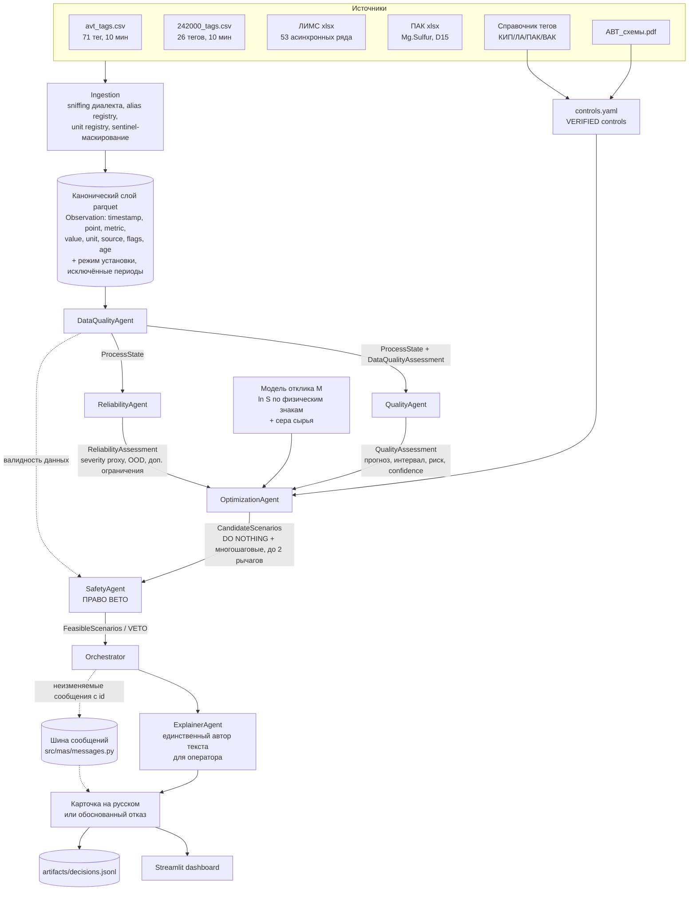

# Архитектура

## Поток данных между агентами

| От | Кому | Что передаётся |
|---|---|---|
| DataQualityAgent | все | `ProcessState` (телеметрия, значения controls, статусы источников, возраст, флаги) |
| QualityAgent | OptimizationAgent, SafetyAgent | `QualityAssessment`: прогноз серы, верхняя граница, риск превышения, статус интервала, прогнозы на горизонты, оценки показателей, confidence, топ-факторы |
| ReliabilityAgent | OptimizationAgent, SafetyAgent | `ReliabilityAssessment`: severity index/class, OOD, дополнительные ограничения |
| OptimizationAgent | SafetyAgent | `CandidateAction[]` с прогнозами качества, production/energy proxy, severity |
| SafetyAgent | Orchestrator | `ConstraintCheck[]` по каждому кандидату с указанием горизонта проверки и список вето |
| Orchestrator | ExplainerAgent | ранжированные допустимые варианты, проверки, трассировка |
| ExplainerAgent | оператор, лог | карточка на русском: риск, действие, эффект, ограничения, уверенность, причины отказа |

Каждое сообщение между агентами неизменяемо и адресуемо: содержимое
сериализуется каноническим образом и хэшируется, id сообщения попадает в
карточку рядом с числами, которые из него взяты. Поэтому любую цифру в
карточке можно проследить до агента, который её произвёл.

## Временная доступность данных

Все признаки собираются на момент решения. Лабораторный результат становится
доступным через 120 мин после отбора пробы, и это запаздывание применяется
одинаково в обучении, в расчёте за период и в работе цикла.

Остатки конформной калибровки помечаются временем получения результата.
Выбираются только остатки, полученные до момента решения. Если их меньше
десяти, интервал и вероятность превышения не строятся. Оценка получает статус
`INSUFFICIENT_HISTORY`.

Режим обучения задаётся параметром `retraining.mode`. В режиме `fixed` блоки
заданы конфигурацией. В режиме `expanding` обучающая выборка расширяется по
времени на все анализы, результат которых уже получен, последние анализы
отводятся под отбор и калибровку отдельными непересекающимися блоками.

## Разделение прогноза и отклика

| | N, прогноз | M, отклик |
|---|---|---|
| Вопрос | что будет при текущем режиме | что изменится, если вмешаться |
| Обучение | супервизия по лабораторным анализам | кинетико-подобная форма с фиксированными знаками |
| Роль в решении | риск и верхняя граница | эффект каждого кандидата |
| Почему раздельно | на замкнутом контуре (R-MEET-12) прогнозная модель не несёт причинного эффекта рычагов |

## Режим установки

`src/data/operating_mode.py` размечает RUNNING / TRANSIENT / SHUTDOWN /
SENSOR_FAULT по телеметрии. Не-рабочие режимы исключаются из обучения,
модельных диапазонов и оценки тяжести, а в рабочем цикле блокируют выдачу
воздействий. Список исключённых интервалов с причинами -
`reports/excluded_periods.csv`.

## Порядок приоритетов в SafetyAgent

1. Валидность данных (HC-04)
2. Жёсткие процессные/модельные границы (HC-03, HC-05)
3. Спецификация продукта гидроочистки, HC-01, сера не выше 10 мг/кг по верхней границе
4. Надёжность (HC-06)
5. Только после этого, экономическое ранжирование

Ни один нижестоящий компонент не может отменить вето: оркестратор получает
только те кандидаты, которые SafetyAgent пометил `feasible`.

## Обмен сообщениями

Каждая передача между агентами оформлена сообщением: отправитель, получатель,
тип, время, ссылки на сообщения, на которые оно отвечает, и канонический
payload. Сообщения неизменяемы, а их идентификатор вычисляется из содержимого,
поэтому два одинаковых цикла дают одинаковый журнал. Журнал цикла попадает в
`artifacts/decisions.jsonl` вместе с решением и показывается во вкладке
"Обмен сообщениями".

| тип | от | кому | смысл |
|---|---|---|---|
| StateReady | DataQualityAgent | всем | состояние процесса на момент t собрано |
| DataQualityVerdict | DataQualityAgent | всем | достоверность источников и флаги |
| QualityEstimate | QualityAgent | OptimizationAgent | прогноз серы, интервал, риск |
| ReliabilityVerdict | ReliabilityAgent | OptimizationAgent | тяжесть режима, выход за область обучения |
| WhatIfRequest | OptimizationAgent | WhatIfAgent, ReliabilityAgent | вопрос об одном кандидате |
| WhatIfResponse | WhatIfAgent, ReliabilityAgent | OptimizationAgent | эффект по модели M либо тяжесть |
| CandidateSet | OptimizationAgent | SafetyAgent | набор вариантов с прогнозами |
| SafetyVerdict | SafetyAgent | Orchestrator | допустимость каждого варианта и вето |
| ReplanRequest | Orchestrator | OptimizationAgent | расширить поиск, допустимых нет |
| ConflictResolved | Orchestrator | всем | чей вердикт принят и почему |
| Decision | Orchestrator | ExplainerAgent | итог цикла |
| Explanation | ExplainerAgent | оператору | карточка на русском |

Оптимизатор не вызывает модель отклика напрямую. Он задаёт вопрос сообщением и
получает ответ, поэтому в журнале видно, какое состояние оценивалось и что
вернула модель, включая отказ оценивать состояние за пределами области
обучения. За цикл с 41 кандидатом это 82 обмена what-if.

Агенты выносят суждения и не изменяют чужие объекты. SafetyAgent возвращает
вердикт по каждому варианту, а применяет его оркестратор: это единственное
место, где вердикт становится признаком допустимости.

## Разрешение конфликтов

Приоритет измерений задан в `src/mas/policies.py` и применяется
лексикографически: достоверность данных, безопасность, качество, надёжность,
выпуск, энергия. Возражение по измерению с более высоким приоритетом не
перекрывается выигрышем по более низкому.

Вариант считается оспоренным, когда один агент признаёт его допустимым, а
другой возражает. Оркестратор публикует ConflictResolved с указанием, чей
вердикт принят, по какому измерению и кто возражал против этого решения. На
тестовом блоке оспоренные варианты встречаются в 5 циклах из 60.

## Раунды перепланирования

Если после вердикта безопасности допустимых вариантов не осталось, оркестратор
отправляет ReplanRequest вместо немедленного отказа. Раундов четыре, считая
обычный поиск нулевым; каждый следующий расширяет пространство поиска одним
объявленным способом.

| раунд | что разрешено дополнительно |
|---|---|
| 0 | обычный поиск |
| 1 | увеличенные шаги кандидатов |
| 2 | комбинации из двух управляемых параметров |
| 3 | снижение нагрузки |

Расширение только добавляет варианты, и каждый из них проходит проверки
заново, поэтому вето не может быть обойдено поздним раундом. Если после
третьего раунда допустимых вариантов нет, система отказывается, а карточка
сообщает, сколько раундов выполнено и чем они закончились.

Сравнение конфигураций с одним раундом и с четырьмя на сетке из 60 циклов
блока оценки даёт долю отказов 0,433 против 0,267. Десять циклов получают
исполнимую рекомендацию, ни один цикл рекомендацию не теряет, выбор варианта
не изменяется ни в одном цикле, где рекомендация выдавалась в обеих
конфигурациях. Нарушений предела по верхней границе нет в обеих
конфигурациях. Измерение выполняет `python -m scripts.replan_value`.

Стоимость расширения поиска вынесена отдельно, поскольку среднее значение её
скрывает.

| Раунд | Циклов | Среднее время, с | Худшее время, с |
|---|---|---|---|
| 0 | 41 | 0,155 | 0,171 |
| 1 | 8 | 0,352 | 0,391 |
| 2 | 2 | 0,585 | 0,607 |
| 3 | 9 | 0,841 | 0,946 |

## Имитационная среда

Замкнутый контур устроен так, что система и установка используют разные
модели. Система рассуждает моделями N и M. Установка моделируется
модулем `src/sim/plant_model.py`. Он реализует реакцию порядка 1,5 в реакторе
вытеснения, константу скорости по Аррениусу, зависимость от времени пребывания
и от давления водорода. Настройка выполняется одной опорной точкой без подгонки
по данным, поэтому модель установки не перенимает закономерности модели M.

По чувствительности к температуре модели расходятся втрое. Значение равно
-0,0204 1/°C у модели M и -0,0659 1/°C у модели установки. Расхождение
составляет предмет проверки, поскольку рекомендация, рассчитанная по M,
применяется к установке с другим откликом.

Модель установки не валидирована. На блоке оценки она занижает содержание серы
примерно в полтора раза и не объясняет вариацию лабораторных значений.
Результат прогона характеризует устойчивость рекомендаций к ошибке модели, а
не поведение установки.

`scripts/plant_robustness.py` усиливает расхождение дальше, меняя
чувствительность установки в полтора раза в обе стороны и удваивая
транспортное запаздывание. Во всех вариантах сера ни разу не превысила
стартовое значение; цена ошибки проявляется в избыточном снижении серы и в
удвоении времени вне спецификации при недооценённом запаздывании.

Сама модель установки не валидирована и физической моделью этой установки не
является, см. `reports/plant_model_validation.json`.
